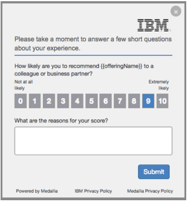

<!------------------------------------------------------------------------------------------------
   Copyright 2016,2019 IBM Corp. All Rights Reserved.

   Licensed under the Apache License, Version 2.0 (the "License");
   you may not use this file except in compliance with the License.
   You may obtain a copy of the License at

        http://www.apache.org/licenses/LICENSE-2.0

   Unless required by applicable law or agreed to in writing, software
   distributed under the License is distributed on an "AS IS" BASIS,
   WITHOUT WARRANTIES OR CONDITIONS OF ANY KIND, either express or implied.
   See the License for the specific language governing permissions and
   limitations under the License.
-------------------------------------------------------------------------------------------------->
# IBM IoT Connected Vehicle Insights - Fleet Management Starter Application

The Fleet Management Starter Application for the IBM® IoT Connected Vehicle Insights SaaS offering demonstrates how quickly you can build an app on IBM Cloud to manage and monitor a fleet of vehicles in real time.


## Overview

The Fleet Management Starter Application uses the IBM IoT Connected Vehicle Insights SaaS offering together with IBM Cloud services to provide a sample solution for fleet operation management and personnel. By using the application,  you can easily track and view the following information:

- Availability of a fleet of cars on a map
- Location of vehicles
- Overall health of the entire fleet
- Health diagnostics and conditions of a specific vehicle in the fleet
- Condition of vehicles by order of severity or risk
- Event history for the entire fleet
- Event history for a specific vehicle in the fleet

The Fleet Management Starter Application uses the following IBM Cloud services:

- [Cloudant NoSQL DB](https://cloud.ibm.com/catalog/services/cloudant)
- [IBM Watson IoT Platform (Optional)](https://cloud.ibm.com/catalog/services/internet-of-things-platform)


## Prerequisites
To deploy and use the Fleet Management Starter Application, you need the following prerequisites.
- An instance of IBM IoT Connected Vehicle Insights that is deployed and running on IBM SaaS.
- An application Admin user is created. For more information about how to create an application Admin user, see the topic [Creating an application admin user](https://www.ibm.com/support/knowledgecenter/SSNQ4V_bas/iot-automotive/managing/assets/maximo_create_app_admin_user.html) in the IBM Knowledge Center.
- You must have an IBM Cloud account. To sign up and get your account, go to https://www.ibm.com/cloud/


## STEP-1. Create Application REST API User

### Create a security group for REST API users
1. Log in to Maximo as an application admin user.
2. Select Go To > Security > Security Groups.
3. Click the 'New Group' icon.
4. Input a group name, for example `APPUSERGROUP`
5. Open the Sites tab, select the check box for 'Authorize Group for All Sites'.
6. Open the Storerooms tab, select the check box for 'Authorize Group for All Storerooms'.
7. Open the GL Components tab, select the check box for 'Authorize Group for All GL Component Types'.
8. Open the Applications tab, within the application table select the following applications individually. When you select an application, a set of application options display. For each application, select the related option in the following table, or select the check box for the listed options.

   |  Application       |  Application option to select   |
   |----------------------------|-------------------------------|
   |Assets (Automotive) |Grant Listed Options to this Application |
   |Event Types (Automotive) |Read access to Event Type |
   |Organizations (Automotive) |Read access to Multisite setup |
   |Rule Definitions (Automotive) |Grant Listed Options to this Application |
   |Companies (SP) |Grant Listed Options to this Application |
   |People (SP) |Grant Listed Options to this Application |
9. Open the Object Structures tab, in the table select the following object structures individually. When you select an object structure, a set of object structure options display. For each object structure, select the related options in the following table.

   |  Object Structure       |  Object Structure options to select   |
   |----------------------------|-------------------------------|
   |MXCLASSIFICATION |Read MXCLASSIFICATION  |
   |MXVENDOR |Delete MXVENDOR, Insert MXVENDOR, Read MXVENDOR, Save MXVENDOR |
   |MXORGANISATION |Read MXORGANISATION |
 10. Save changes.

### Create an application user to access Maximo REST API
1. Log in to Maximo as an application admin user.
2. Select Go To > Security > Users.
3. Click the 'New User' icon.
4. Open the 'User' tab and in the 'User Name' field, enter a user name.
5. For the user, select 'Set Password'and unselect the following password options.
- 'E-mail Password to User?', if allowed by your environment.
- 'Password Should Expire After First Login?'
6. Within User Settings, in the 'Default Insert Site' field, select DEFREG.
7. Open the 'Groups' tab and click the 'Select Groups' button.
8. Select the group that you created in the previous set of steps, for example `APPUSERGROUP`.
9. Click OK.
10. Save changes.


## STEP-2. Setup Maximo for the Starter App

### Configure Custom Vehicle Attributes
1. Log in to Maximo as an application admin user.
2. Select Go To > Administration > Classifications (SP)
3. Click the 'New Classification' icon.
4. In the 'Classification' field, enter a classification name, for example FLEET VEHICLE.
5. This classification ID will be used in an environment value for the starter app.
6. In the 'Organisation' field, select an organisation. The default organisation is IOTFA.
7. In the 'Region/Site' field, select a site. The default site is DEFREG.
8. In the 'Use With' table, click 'New Row' and in the 'Use with Object' field select ASSET.
9. In the 'Attributes' table, click 'New Row' to add each attribute and related 'Data Type' value that is listed in the following table. Also, for each attribute deslect 'Use in Specifications'.

   |  Attribute      |  Data Type   |
   |-----------------|--------------|
   |FUELTANK |NUMERIC  |
   |MILEAGE |NUMERIC |
   |YEAR |NUMERIC |
   |THUMBNAILURL |ALN  |
   |DEST_LAT |NUMERIC |
   |DEST_LON |NUMERIC |
   |TCU_ID |ALN |

### Get Organization ID
1. Log in to Maximo as an application admin user.
2. Select Go To > Administration > Organizations (Automotive)
3. Find the oranization ID, for example IOTFA. The organization ID will be used in an environment value for the starter app.


## <a id="deploying-the-app"></a> STEP-3. Deploying the app

Deploy the Fleet Management Starter Application on IBM Cloud either automatically or manually, as outlined in the following instructions.

### Automatically deploy the starter app on IBM Cloud

The automatic deployment option creates an instance of the app and the required IBM Cloud services, and also binds the services to the starter app automatically.
To automatically deploy the Fleet Management Starter Application on IBM Cloud, click [](https://cloud.ibm.com/devops/setup/deploy?repository=https://github.com/ibm-watson-iot/cvi-starter-server-fm.git&branch=v2.x) and complete step 1, you only complete step 2 if step 1 fails.
1. Within the IBM Cloud landing page, enter details in each field, then select 'Deploy'. For more information about field details, see the following table.

   |  Field name      |  Sample details  |
   |-----------------|--------------|
   |Toolchain Name |Leave the default entry.  |
   |Select Region |Select region nearest to you |
   |Select a resource group |Use the default entry, if you have not purchased another option. |
   |App name |Leave the default entry.  |
   |IBM Cloud API Key |Select 'Create'. A key displays. Select 'Create'. |
   |Region |Select region nearest to you. |
   |Organization |Select choice from the drop-down menu. |
   |Space |Select choice from the drop-down menu. |

1. If step 1 fails to complete, then complete the following steps.
    1. Within the IBM Cloud landing page, expand the IBM Cloud navigation menu.
    1. In the navigation menu, select 'DevOps'.
    1. Within the DevOps navigation menu, select 'Toolchains'.
    1. Select 'Delivery Pipeline'.
    1. Select your `cvi-starter-server-fm-`.
    1. In the Deploy Stage widget, select 'View logs and history'.
    1. If you see timing issues like `FleetCloudantDB is not ready...`, then select 'Run option again'.

After the automated deployment, complete the following steps to configure the app to manually connect to your IBM IoT Connected Vehicle Insights SaaS service.

1. Open the IBM Cloud dashboard in your browser.
2. To stop the app, click **ACTIONS** > **Stop App**.

Next: Go to [Connecting to IBM IoT Connected Vehicle Insights service](#connect2cvi).

### Manually deploy the starter app on IBM Cloud

To manually deploy the Fleet Management Starter Application on IBM Cloud, complete all of the following steps:
1. Log in to IBM Cloud. If you do not have an existing IBM Cloud account, click [Register][ibmcloud_signup_url] and follow the instructions to create an account.
2. Download and install the [IBM Cloud CLI][cloud_foundry_url] tool.
3. Clone the Fleet Management Starter Application to your local environment by using the following console command:

  ```
  git clone https://github.com/ibm-watson-iot/cvi-starter-server-fm.git
  ```
4. Change to the directory that you created.
5. Edit the `manifest.yml` file and change the values of `<name>` and `<route>` to something unique. `<route>` must be same with `postUrl` in gateway.properties. Note that the `route` value is used to generate your application URL.

    ```
    applications:
      - name: cvi-starter-server-fleetmanagement
        path: .
        memory: 512M
        instances: 1
             :
      env:
        AUTOMOTIVE_URL: https://<prefix>.automotive.internetofthings.ibmcloud.com/
        AUTOMOTIVE_USERNAME: iotcvusr
        AUTOMOTIVE_PASSWORD: <iotcvusr_password>
        AUTOMOTIVE_MAX_ORGID: IOTF
        AUTOMOTIVE_MAX_CLASSIFICATION_ID: FLEET VEHICLE
        AUTOMOTIVE_MAX_USERNAME: <maximo_starter_username>
        AUTOMOTIVE_MAX_PASSWORD: <maximo_starter_password>
     routes:
        - route: cvi-starter-server-fleetmanagement.mybluemix.net
    ```
    Also, set appropriate values to environment variables under `<env>`. See the table in [this section](#connect2cvi) about the variables.  

6. Install the NPM package by using the following command. The installer observes the dependencies that are specified in your `package.json` file.
  ```
  $ cd ./webclient
  $ npm install
  ```
7. Convert TypeScript to JavaScript:

  ```
  $ npm run tsc
  $ npm run gulp
  $ cd ..
  ```

8. By using the command line tool, connect to IBM Cloud and log in when prompted:

  ```
  $ ibmcloud api https://cloud.ibm.com
  $ ibmcloud login
  $ ibmcloud target --cf
  ```

9. Create an instance of the Cloudant NoSQL DB service in IBM Cloud:

  ```
  $ ibmcloud cf create-service cloudantNoSQLDB Lite FleetCloudantDB
  ```

11. Push the starter app to IBM Cloud by using the following command:
  ```
  $ ibmcloud cf push --no-start
  ```
  **Important:** When you run the `push` command, you must include the `--no-start` option as you must complete further steps manually before you start the app.

**Result:** Your very own instance of the IBM IoT Connected Vehicle Insights - Fleet Management Starter Application is now deployed on IBM Cloud.


## STEP-4. Deploying custom plug-ins to your IBM IoT Connected Vehicle Insights instance
To run the Fleet Management Starter Application with your IBM IoT Connected Vehicle Insights instance, the following two custom plug-ins must be deployed to your IBM IoT Connected Vehicle Insights instance. The source code of the plug-ins is provided as sample plug-ins of IBM IoT Connected Vehicle Insights Plug-in Development Tool.

|          Plug-in        | Component              | Description                          |
|------------------------|------------------------|--------------------------------------|
| HttpActionNotifyClient | Vehicle Data Hub (VDH) | A VDH plug-in that accepts sendCarProbe requests from simulated vehicles and POSTs affected events and notified messages to the Fleet Management Starter Application. |
| FleetAlert             | Agent                  | A rule plug-in that calculates moving average of each vechicle acceleration from recent car probes. A acceleration alert generate a quick acceleration or a harsh breaking warning to be notified to the Fleet Management Starter Application. |

To build and deploy the plug-ins, complete the following steps:

### Prerequisites
1. The IBM IoT Connected Vehicle Insights Plug-in Deployment Tool must be installed and enabled on your IBM IoT Connected Vehicle Insights SaaS instance. Contact the system administrator for your IBM IoT Connected Vehicle Insights SaaS service to make a request to enable it.
1. The IBM IoT Connected Vehicle Insights Plug-in Development Tool must be installed on your eclipse IDE, as outlined in the [IBM IoT Connected Vehicle Insights Knowledge Center](https://www.ibm.com/support/knowledgecenter/SSNQ4V_gbs/iot-automotive/customizing/plugin_dev_tool.html). To get access to the tool, contact your IBM IoT Connected Vehicle Insights system administrator.

### Install the IBM IoT Connected Vehicle Insights Plug-in Development Tool on your eclipse IDE.
1. Install the Eclipse for Java EE developers
1. Download the IBM IoT Connected Vehicle Insights Plug-in Development Tool ZIP file, see Plug-in SDK in the [IBM IoT Connected Vehicle Insights Knowledge Center: Developer resources](https://www.ibm.com/support/knowledgecenter/SSNQ4V_gbs/iot-automotive/iota_dev_kit/iota_dev_kit.html). To get access to the tool, contact your IBM IoT Connected Vehicle Insights system administrator.
1. Under <eclipse home>/dropins, create a folder named “CVIDevTool”
1. Expand the zip to <eclipse home>/dropins/CVIDevTool/.
   ```
    <eclipse home>/dropins/CVIDevTool/ecipse/features/…
    <eclipse home>/dropins/CVIDevTool/ecipse/plugins/…
    ```
1. Start Eclipse.

### Create sample plug-in projects for the starter app into eclipse workspace
1. In Eclipse, select **File > New > Example...**.
1. Select `IBM IoT Connected Vehicle Insights > IBM IoT Connected Vehicle Insights Plug-in Example`.
1. Click **Next**.
1. Select `Vehicle Data Hub` for Project type
1. Select `HTTP Action Notify Client` and click **Finish**
1. In the same manner, create a `FleetAlert` project of `Rule` project type

### Export custom plug-in jars
1. In Elipse, within the package explorer view, right click the HttpActionNotifyClient project and select Export.
1. Select **Java > JAR file**
1. Click **Next**.
1. Ensure `HttpActionNotifyClient` is checked.
1. Input a file name in the **JAR file** field and click **Finish**.
1. In the same manner, export the `FleetAlert` project.

### Update a VDH configuration file (gatway.properties)
1. Download a copy of the `gateway.properties` file that you deployed on the VDH server by using IBM IoT Connected Vehicle Insights Plug-in Deployment Tool.
1. Open the `gateway.properties` file with a text editor.
1. Increment `client.num` in the `gateway.properties` file.
1. Insert the following two lines before the DefaultHTTPClient client definition.
   ```
   client.client1=com.ibm.mobility.sample.http.HttpActionNotifyClient
   client.client1.protocol=http
   ```
1. Renumber all the existing client definition keys so that they do not conflict with each other, for example:
   ```
   client.client2=com.ibm.mobility.autodrive.client.def.DefaultHTTPClient
   client.client2.protocol=http
   client.client2.agent=SM_API
   ```
1. Insert the following client unique properties:
   ```
   HttpActionNotifyClient.postUrl=https://<your-iota-starter-fleetmanagement>.mybluemix.net
   HttpActionNotifyClient.postUser=starter
   HttpActionNotifyClient.postPassword=Starter4Iot
   ```
   1. For `postUrl`, replace the example URL with your Fleet Management app URL.
   2. If you modified the default `postUser` and `postPassword` credentials, replace the values that are specified in the properties file.
   3. Save the changes and close the editor.

A fragment of the gateway.properties file exists under `conf` folder of the `HttpActionNotifyClient` project. You can copy contents from the file.

### Deploy custom plug-ins to IBM IoT Connected Vehicle Insights
1. Deploy exported `HttpActionNotifyClient` jar and updated gateway.properties to the VDH server using IBM IoT Connected Vehicle Insights Plug-in Deployment Tool.
1. Deploy exported `FleetAlert` jar to the Agent server.
1. Restart IBM IoT Connected Vehicle Insights components using IBM IoT Connected Vehicle Insights Plug-in Deployment Tool as needed.

## <a id="connect2cvi"></a> STEP-5. Connecting the app to your IBM IoT Connected Vehicle Insights service

After deploying the app on IBM Cloud, you must configure the app to connect to your IBM IoT Connected Vehicle Insights SaaS service instance.

### Configuring IBM IoT Connected Vehicle Insights endpoints and credentials
To connect to your IBM IoT Connected Vehicle Insights service instance, the starter app reads the REST API endpoints and credentials from an environment variable on IBM Cloud. Configure the environment variables as follows:

1. Open the [IBM Cloud dashboard][ibmcloud_dashboard_url] in your browser.
1. Open your fleet management app deployed at [Deploying the app](#deploying-the-app) step.
1. Select **Runtime** tab at the left navigation bar.
1. Click **Environment variables**.
1. Add the following environment variable:

To obtain the correct values, contact your system administrator.

Key | Description of Value | Example
----- | ------------------------------------- | -----
AUTOMOTIVE_URL | A URL to call the REST API for IBM IoT Connected Vehicle Insights, which must end with a forward slash character (/) | [https://xxxx.automotive.](https://xxxx.automotive.internetofthings.ibmcloud.com/) <br> [internetofthings.ibmcloud.com/](https://xxxx.automotive.internetofthings.ibmcloud.com/)
AUTOMOTIVE_USERNAME | User name for accessing the Vehicle Data Hub (VDH) and other IBM IoT Connected Vehicle Insights endpoints | iotcvusr
AUTOMOTIVE_PASSWORD | Password for accessing the VDH and other IBM IoT Connected Vehicle Insights endpoints | CVIPassword
AUTOMOTIVE_MAX_ORGID | IBM IoT Connected Vehicle Insights Organization specified in IBM Maximo Asset Management | IOTFA
AUTOMOTIVE_MAX_CLASSIFICATION_ID | Classification for vehicle data defined in Maximo Asset Management | FLEET VEHICLE
AUTOMOTIVE_MAX_USERNAME | User name for accessing the Maximo Asset Management API | starter
AUTOMOTIVE_MAX_PASSWORD | Password for accessing the Maximo Asset Management API | StarterPassword


## STEP-6. Configuring authentication

To secure the app, authentication is enabled by default for the IBM IoT Connected Vehicle Insights - Fleet Management Starter Application. The default user credentials are as follows:

User name | Password
----- | -----
starter | Starter4Iot

- To change the user name or password that is used by the app, edit the values that are specified for the `APP_USER` and the `APP_PASSWORD` environment variables.

- To remove authentication, set both the `APP_USER` and `APP_PASSWORD` environment variables to 'none'.


## <a name="run"></a> STEP-7. Starting the app

To start the Fleet Management Starter Application, complete one of the following steps.
- Open the [IBM Cloud dashboard][ibmcloud_dashboard_url] and start the app.
- Start the app from the terminal, use the following `ibmcloud`commands.
    1. Get starter application name, enter `$ ibmcloud cf apps`.
    2. Start application, enter `$ ibmcloud cf start $STARTER_APPLICATION_NAME`


Congratulations! You are now ready to use your own instance of the IBM IoT Connected Vehicle Insights - Fleet Management Starter Application. To connect to the app, enter the following URL in your browser:
`http://<host>.mybluemix.net` in your browser.


## STEP-8. Set up the OBDII Fleet Management App

To build and install the OBDII Fleet Management App on a mobile phone, see the following repositories.
 - For Android phone, see [IBM IoT Connected Vehicle Insights - OBDII Fleet Management App for Android](https://github.com/ibm-watson-iot/iota-starter-obd-android).
 - For iOS phone, see [IBM IoT Connected Vehicle Insights - OBDII Fleet Management App for iOS](https://github.com/ibm-watson-iot/iota-starter-obd-ios).  The OBDII Fleet Management App for iOS will become available at a future date.


## STEP-9. (Optional) Connecting to an OBDII dongle that is plugged in to your car

The starter app also provides a mobile app to connect to an OBDII dongle plugged in to your car. The mobile app sends data from an OBDII dongle to the Fleet Management Starter Application through the Watson IoT Platform service and you can see the data in the app. Complete the steps below to enable this optional feature.

### Prerequisite for MQTT capability
You can send car probe data from mobile apps using MQTT. To enable MQTT capability on your fleet management starter app, complete the following pre-requsite steps.
1. Create IoT Platform services and bind your application.
```
$ ibmcloud cf create-service iotf-service iotf-service-free FleetIoTPlatform
$ ibmcloud cf bind-service <app_name> FleetIoTPlatform
$ ibmcloud cf restage <app_name>
```
2. Create IoT Platform API Key.
   a. From IBM Cloud Dashboard, start IoT Platform.
   b. From the sidebar, select Apps.
   c. Click 'Generate API Key'.
   d. click 'Next'.
   e. Select 'Standar Application for Role'.
   f. Click 'Generate Key'.
   g. Copy API Key and Authentication Token.
3. Enable MQTT Client on the CVI.
   - Update the following VDH configuration files.

   | gateway.properties      |  pos_mapping_def.xml   |
   |----------------------------|-------------------------------|
   |Increment client.num |Append attributes for tenant_id, <br> engineTemp and fuel in SEND_CARPROBE command|
   |Add DefaultMQTTClient configuration |   |

   - Deploy the VDH configuration files to VDH by using the plug-in deploy REST API.
   - Resart VDH by using the plug-in deploy REST API.


### Bind the Watson IoT Platform service to the app

1. Open the [IBM Cloud dashboard][ibmcloud_dashboard_url] in your browser.
1. Open the IBM IoT Connected Vehicle Insights service.
1. Select **Connections** tab at the left navigation bar.
1. Click **Connect New**.
1. Select *IBM Watson IoT Platform* service, and then click **Create** to bind the service.

### Set up the OBDII Fleet Management App

To build and install the OBDII Fleet Management App on a mobile phone, see the following repositories.
 - For Android phone, see [IBM IoT Connected Vehicle Insights - OBDII Fleet Management App for Android](https://github.com/ibm-watson-iot/iota-starter-obd-android).
 - For iOS phone, see  [IBM IoT Connected Vehicle Insights - OBDII Fleet Management App for iOS](https://github.com/ibm-watson-iot/iota-starter-obd-ios). The OBDII Fleet Management App for iOS will become available at a future date.

 After deploying the Fleet Management Starter Application, start OBDII Fleet Management App on your phone.

### Connect the device to the IBM IoT Connected Vehicle Insights service

When you start the OBDII Fleet Management App for the first time, your device is registered automatically to the IoT Platform service that you have specified in the mobile app, and a corresponding vehicle is created automatically.

Now that your device is connected to the Watson IoT Platform, go to the  **Map** or **Car Status** page in the app and see the status.

If you no longer need a device, go to **Vehicle** page in your Fleet Management Starter Application on your browser and delete your vehicle manually. A device corresponding to deleted vehicle must be removed from your IoT Platform.


## Reporting defects
To report a defect with the IBM IoT Connected Vehicle Insights - Fleet Management Starter Application, go to the [Issues section](https://github.com/ibm-watson-iot/cvi-starter-server-fm/issues) section.


## Troubleshooting
To debug problems, check the IBM Cloud app logs. To view the logs, run the following command from the Cloud Foundry CLI:

  ```
  $ ibmcloud app logs --recent <application-name>
  ```


## Providing feedback to IBM

Thank you for using our IBM® IoT Connected Vehicle Insights SaaS service and starter apps. As well as providing samples to help you get started, we'd like to know what you and your users think about our service offering.

The IBM IoT Connected Vehicle Insights Fleet Management starter application sample also includes the [Medallia](http://www.medallia.com/) Net Promoter Score (NPS) widget code, which you can choose to deploy with the apps that you develop to integrate with the service.

### The Net Promoter Score widget
The NPS widget provides a mechanism for you and your app users to rate your overall experience with the IBM IoT Connected Vehicle Insights service and to provide specific feedback comments to help us to continually improve the quality of the service offering and to increase your satisfaction. When you build an application by using our sample code, the NPS widget is automatically included in your app and provides the following user interface for providing feedback to IBM:



When you or your app users rate the IBM IoT Connected Vehicle Insights service by completing the survey in the NPS widget, the rating score, feedback comments, and customer ID are automatically submitted back to IBM.

### Disabling the NPS widget

By default, when you build an app by using the Fleet Management starter app sample code that is in this repository, the NPS widget is enabled. If you would like to remove the NPS widget from the user interface of your apps, complete the following steps:

1.  In this repository. go to the `/webclient` folder.
1.  Edit both the `index.html` and `index-prod.html`files and remove all of the code from ```<!-- NPS Widget BEGIN --> ``` to ``` <!-- NPS Widget END -->```.
1.  Save your changes.

### More information about the NPS widget

The IBM NPS widget is produced in partnership with [Medallia](http://www.medallia.com/). For information about the widget and the data that it collects, see [Privacy Policy - Medallia](http://www.medallia.com/privacy/).


## Questions, comments or suggestions
For your questions, comments or suggestions to us, visit [IBM Community for IBM IoT Connected Vehicle Insights](https://community.ibm.com/community/user/imwuc/communities/globalgrouphome?CommunityKey=eaea64a5-fb9b-4d78-b1bd-d87dc70e8171).


## Useful links
- [IBM Cloud](https://cloud.ibm.com)
- [IBM Cloud Documentation](https://cloud.ibm.com/docs)
- [IBM Cloud Developers Community](https://developer.ibm.com/depmodels/cloud)
- [IBM Watson Internet of Things](http://www.ibm.com/internet-of-things)
- [IBM Watson IoT Platform](https://www.ibm.com/internet-of-things/solutions/iot-platform/watson-iot-platform)
- [IBM Watson IoT Platform Developers Community](https://developer.ibm.com/iotplatform)
- [IBM Marketplace: IBM IoT Connected Vehicle Insights](https://www.ibm.com/us-en/marketplace/iot-for-automotive)

[ibmcloud_dashboard_url]: https://cloud.ibm.com/resources
[ibmcloud_signup_url]: https://cloud.ibm.com/registration
[cloud_foundry_url]: https://cloud.ibm.com/docs/cli?topic=cloud-cli-install-ibmcloud-cli
